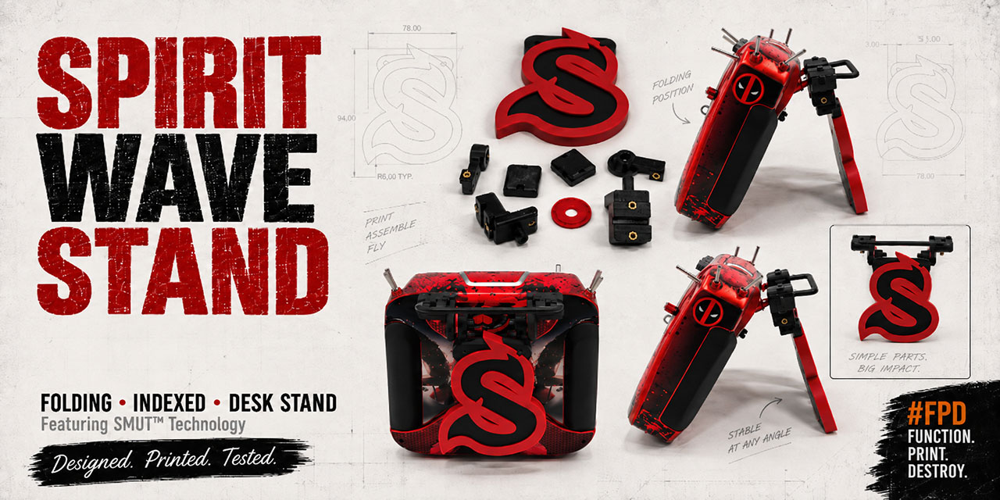
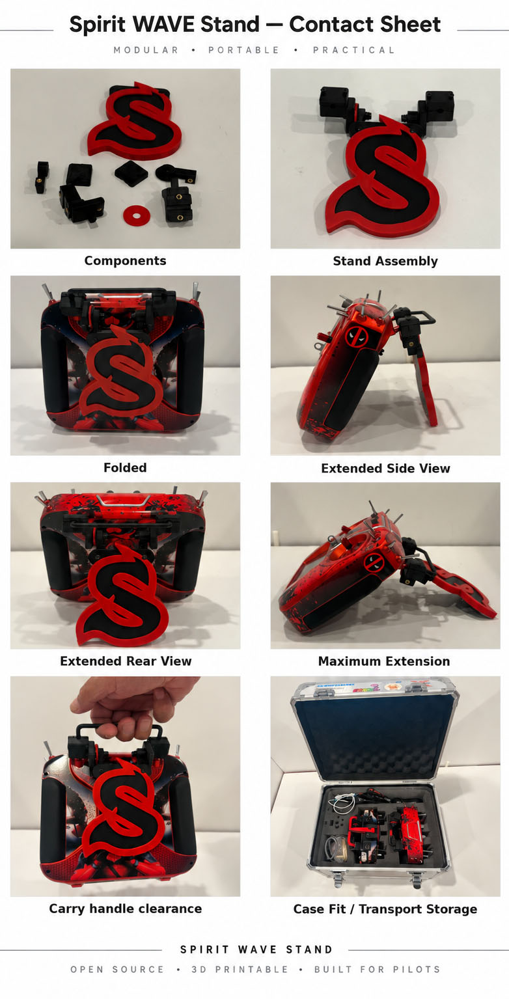

# Folding Indexed Stand for the Spirit WAVE

A folding, indexed-position desk stand designed for the round carrying handle on the Spirit WAVE transmitter.

The stand mounts without permanently modifying the radio, folds against the back, preserves normal access to the carrying handle, and uses a spring-loaded ball plunger with a replaceable detent ring to provide positive indexed positions.

This project is a Spirit WAVE implementation of **SMUT™** — **S**ide **M**ount **U**nit **T**echnology — the same retained-pivot architecture proven on the Spektrum iX14, adapted here with WAVE-specific handle cases and a WAVE-specific stand/header.

## What Changed for the WAVE?

The pivot and detent mechanism is intentionally familiar:

- independent left and right retained pivots;
- replaceable keyed detent ring;
- M4 × 0.7 spring-loaded ball plunger;
- square keyed stand blocks that carry shear and twisting load;
- M3/M4 heat-set inserts and conventional metric hardware.

The radio-specific pieces are the **WAVE handle cases/caps** and the **stand/header geometry**.

The WAVE handle cases follow the actual round metal handle path, while the stand uses a reusable 46 mm-center **Header Mule** mechanical core. That makes the architecture:

**standardized mechanical header + radio-specific case interface + whatever stand body you want**

The supplied Spirit-S stand is one implementation of that architecture.

## Start Here

- [Assembly instructions](documentation/assembly-instructions/assembly-instructions.md)
- [Printable three-stage assembly guide](documentation/exploded-view/SpiritWave-assembly-guide.pdf)
- [Hardware buy list](buy-list/Spirit%20WAVE%20Stand%20-%20Buy%20List.md)
- [Bambu Studio notes](bambu-studio-3mf/bambu-studio-profile.md)
- [Individual STL/SCAD files](stl-scad/)
- [Product photos](documentation/product-images/)

For Bambu Studio users, ready-to-slice projects are provided separately for the mounting hardware and stand:

- [SpiritWave_all_mounting_hardware.3mf](bambu-studio-3mf/mounting-hardware/SpiritWave_all_mounting_hardware.3mf)
- [SpiritWave-Stand.3mf](bambu-studio-3mf/stand/SpiritWave-Stand.3mf)

A merged stand STL is also provided for non-Bambu workflows:

- [SpiritWave-Stand-merged.stl](stl-scad/stand/SpiritWave-Stand-merged.stl)

## Product Photos

The product-image directory contains photographs of the actual printed parts and completed assembly, including separate components, assembled and folded positions, extension views, carrying-handle clearance, and transport-case fit.

These are photographs of the physical build, not CAD renders.

## Important WAVE-Specific Assembly Notes

### Ball-plunger insert collar

Because of the print geometry around the M4 ball-plunger insert, the collar may not seat perfectly cleanly after printing.

If needed, **lightly clean the collar/opening with a reamer** before installing the insert. Remove only enough material to clean up the printed opening; do not enlarge the bore unnecessarily.

### Common case caps

The two case caps are identical. There is no left cap and right cap.

Install each cap with the **beveled edge facing away from the radio**.

Tighten the cap screws until you feel a **good bite** and the cases are secure on the handle. A **visible gap between the cap and case body is normal**; the cap does not need to close flush.

Do not keep tightening simply to eliminate the gap.

### Transport case

> **The radio will not fit in the stock Spirit case with this stand installed unless you are willing to modify the case.**

The physical build shown here is transported in a **Spektrum two-radio case**, which is convenient when carrying multiple transmitters.

## Header Mule — Reusable Mechanical Core

The repository includes the SpiritWave Header Mule STL and SCAD in stl-scad/mounting-hardware/.

This header is the reusable mechanical core for alternate stand designs.

A custom stand can be modeled around or through the Header Mule while preserving:

- the 46 mm mounting-center spacing;
- keyed pivot interfaces;
- screw locations;
- header thickness;
- pivot/rotation clearance.

Stand-specific outlines, chamfers, logos, colors and styling can then be added around that mechanical interface.

## Print and Validation Status

The design was developed through repeated physical fitting and printing rather than CAD-only validation:

**measure → model → print → test → revise**

The WAVE-specific case geometry, common cap, pivot mechanism, Header Mule and Spirit-S stand have all been physically printed and fitted.

PETG is the intended production material for the current build. The supplied Bambu Studio projects are the easiest starting point because they preserve the prepared object layout and stand color separation.

As with any 3D-printed mechanical part, verify fit and motion on your own printer before relying on the stand.

## AI-Assisted Design and Development

This project was developed with AI assistance.

AI was used throughout the iterative process to help translate physical measurements into printable geometry, revise handle-path and case fit, preserve and adapt the SMUT™ pivot architecture, develop the reusable Header Mule, refine the stand outline and multicolor geometry, evaluate clearances and fastener placement, and organize printable artifacts and documentation.

The generated geometry was never treated as correct simply because it looked correct on screen.

The printer and the actual radio got the final vote. :-)

## Repository Organization

| Directory | Contents |
|---|---|
| bambu-studio-3mf/ | Ready-to-slice Bambu Studio projects and print notes |
| buy-list/ | Required metric hardware and inserts |
| documentation/assembly-instructions/ | Detailed Markdown assembly instructions |
| documentation/exploded-view/ | Printable PDF assembly guide and page images |
| documentation/product-images/ | Photographs of the physical build |
| stl-scad/mounting-hardware/ | WAVE case hardware, reusable Header Mule and source/reference geometry |
| stl-scad/stand/ | Spirit WAVE stand STL/SCAD components and merged STL |

Unlike the iX14 project, this repository has **no V1/V2 split**. It contains the current Spirit WAVE implementation directly at the repository root.

## Important Safety Information

- This is a desk/simulator stand, **not a replacement carrying handle**.
- Inspect every print, heat-set insert and fastener before use and periodically afterward.
- Confirm the stand is stable before placing the radio on an elevated, uneven or windy surface.
- Never force the stand beyond its intended range of motion.
- Read [DISCLAIMER.md](DISCLAIMER.md) before printing or using the design.

## Unofficial Community Project

This is an independent community project and is not affiliated with or endorsed by Spirit System.

Spirit, Spirit System, WAVE, associated logos and other brand identifiers remain the property of their respective owners. Their appearance here identifies the compatible transmitter and the physical community build; it does not imply sponsorship or endorsement.

## License

This project is provided under the [Creative Commons Attribution-NonCommercial 4.0 International License](LICENSE).

You may print, copy, share and modify the files for noncommercial purposes with attribution. Changes must be identified.

The original files and derivatives may not be sold or otherwise used commercially without separate permission from the creator.

## Why?

Because apparently the natural progression of:

**RC helicopters + 3D printing + AI + excessive iteration**

is building a modular indexed stand architecture and then adapting it to every transmitter that wanders into the shop.

And that's pretty kewl. :-D
